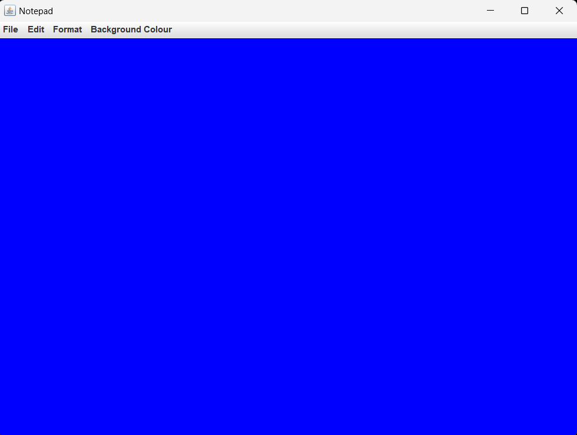
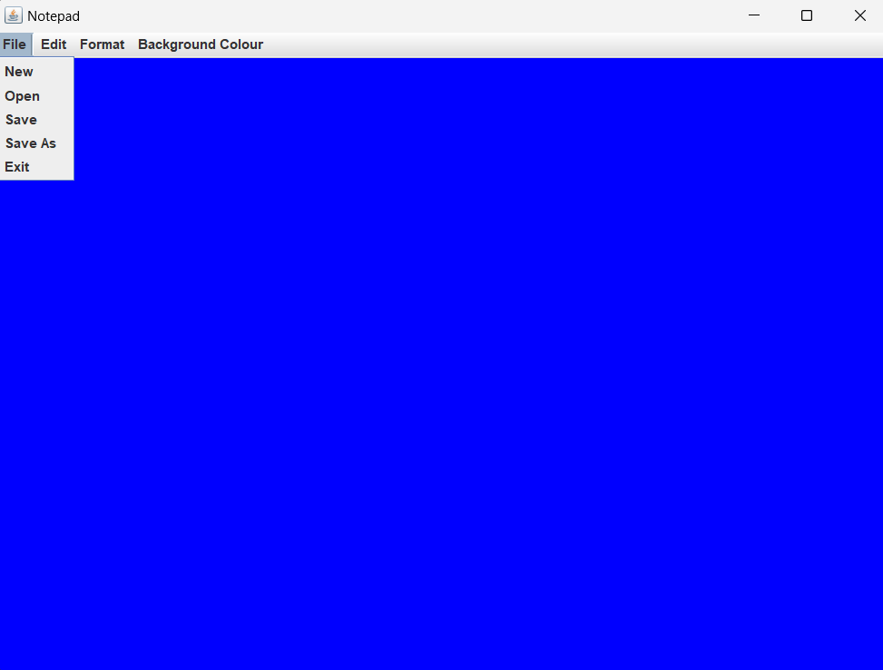
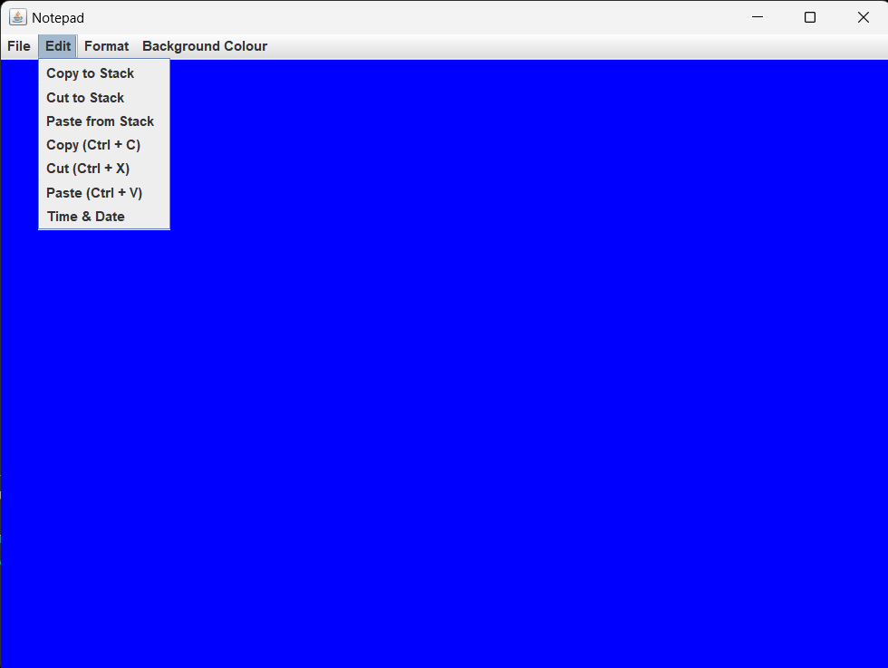
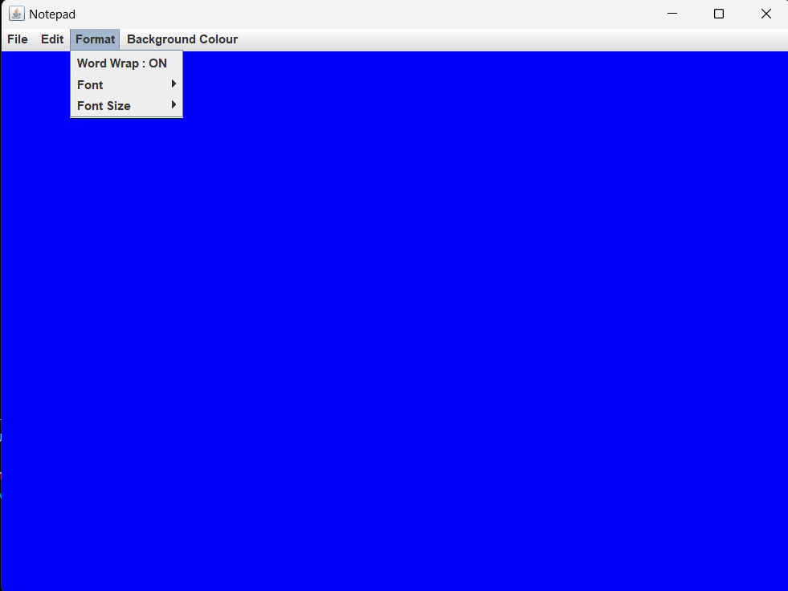
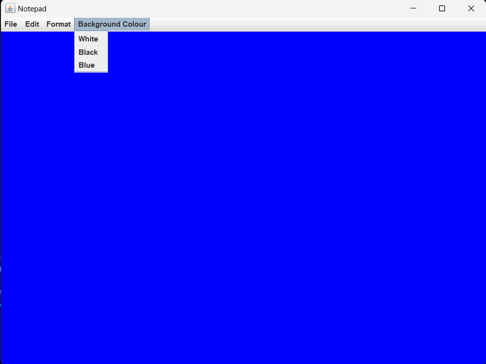

# Notepad (TextEditor)

--> Java based Notepad with Stack type clipboard to keep multiple strins in clipboard\
--> Graphical User Interface made by Java Swing\
--> A menu bar with follwing menus
 * 1. **File handling** (New , Open , Save, Save As , Exit),
 * 2. **Editing options** (Cut , Copy , Paste)
 * 3. **Formating of Fonts** with fontsize and font type with Word Wrap option
 * 4. **Background colour** change
